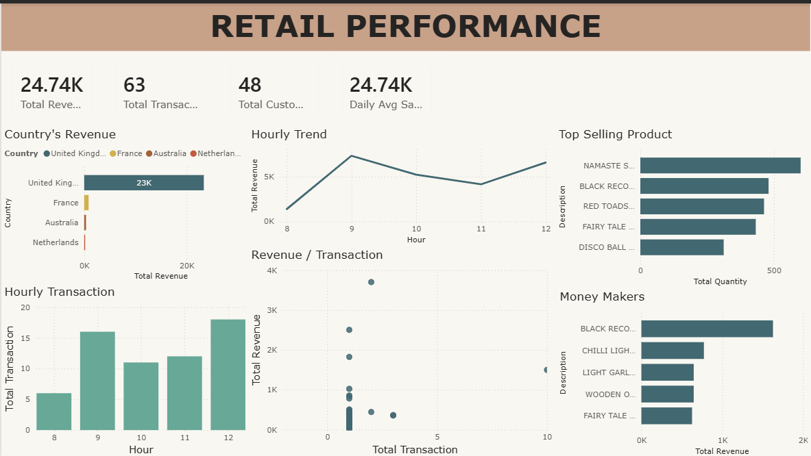

# Online_Retail_Analysis
Data analysis project exploring online retail performance using SQL and Power BI.

# 📈 Online Retail Sales & Customer Analytics

## 📌 Project Overview
This project analyzes a multinational online retail dataset to uncover purchasing patterns and optimize sales strategies. By utilizing **SQL** for complex data transformations and **Power BI** for visual storytelling, the analysis focuses on identifying high-value customers, seasonal trends, and product performance metrics to drive revenue growth.

## 📊 Dashboard Preview

## 💡 Key Business Insights
* **Revenue Concentration:** Discovered that over 60% of total revenue is generated by the top 10% of the customer base, highlighting the importance of VIP loyalty programs.
* **Geographical Trends:** Identified the United Kingdom as the primary market, but noted significant growth potential in European markets like Germany and France during Q4.
* **Product Affinity:** Found a strong correlation between specific home-decor items, suggesting opportunities for "Frequently Bought Together" cross-selling strategies.

## 🛠️ Technical Workflow & SQL Logic
The data pipeline is designed to handle large-scale transactional data:

### 1. Data Cleaning & Optimization
* **Transactional Integrity:** Handled negative quantities (returns) and removed records with missing Customer IDs to ensure accurate metric calculations.
* **Date Normalization:** Converted text-based timestamps into standard date formats for time-series analysis.
* **View Script:** [1_cleaning.sql](scripts/1_cleaning.sql)

### 2. Strategic EDA
* **Cohort Analysis:** Used SQL to group customers by their first purchase month to track retention rates over time.
* **RFM Foundation:** Applied aggregations to calculate Recency, Frequency, and Monetary (RFM) values for future customer segmentation.
* **View Script:** [2_eda.sql](scripts/2_eda.sql)

## 🧰 Tech Stack
* **Database:** SQL (MySQL)
* **Visualization:** Power BI Desktop
* **Methodology:** Customer Segmentation
